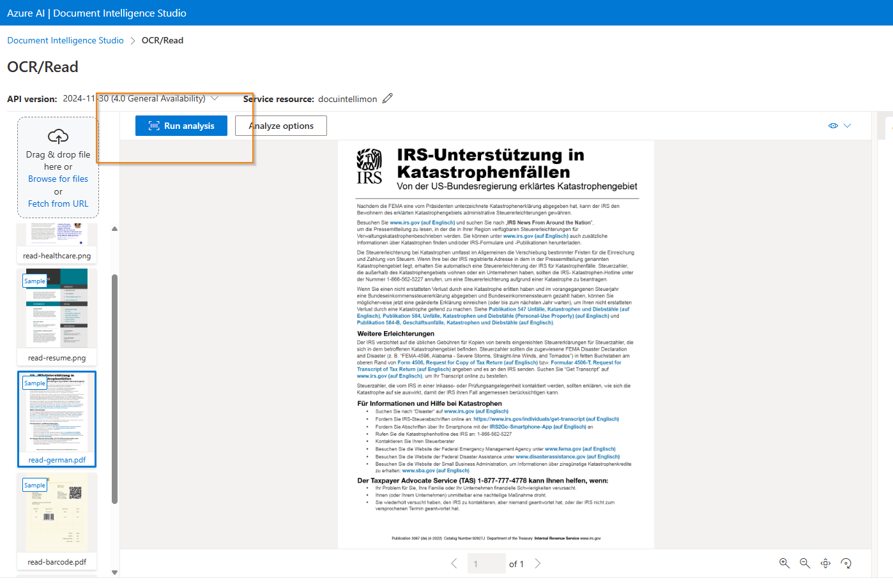
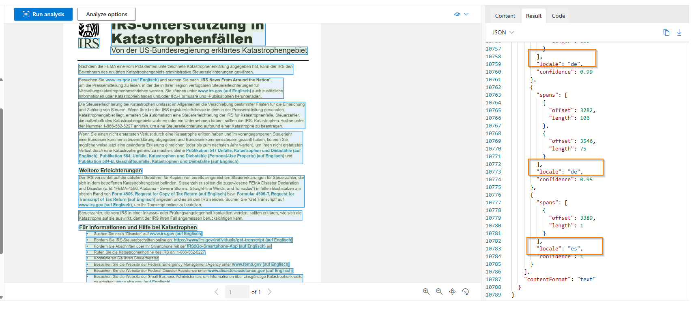
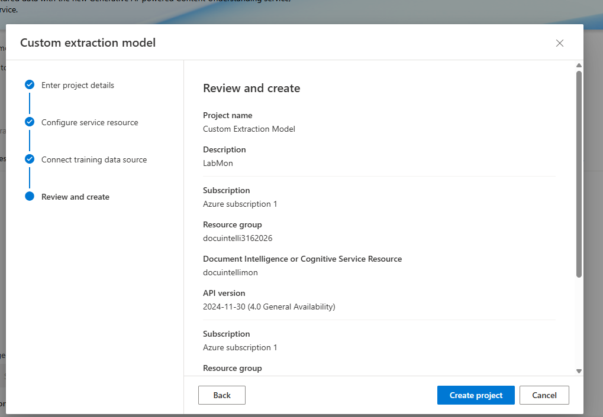
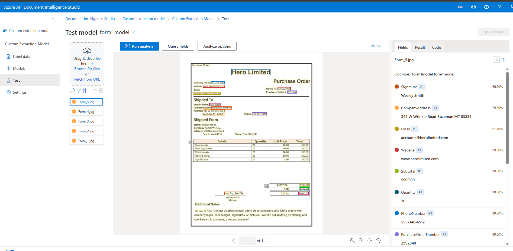

# Secure Document Processing with Azure AI Document Intelligence

## Exploring Secure Document Extraction & Trusted Data Processing

Enterprise AI is not just about generating content—it is also about extracting trusted data from documents securely and reliably.

This lab demonstrates how Azure AI Document Intelligence can process invoices, purchase orders, scanned forms, and multilingual documents using OCR, structured field extraction, confidence scoring, and custom extraction models.

By combining prebuilt models with custom-trained extraction workflows, organizations can transform unstructured documents into validated business data while reducing manual review and improving operational trust.

This approach strengthens governance by ensuring only approved and validated extracted information is trusted for downstream business processes.

---

## Environment

- Platform: Azure AI Document Intelligence Studio
- Service: Azure AI Document Intelligence
- API Version: 2024-11-30 (4.0 General Availability)
- Features Used:
  - OCR / Read Model
  - Language Detection
  - Custom Extraction Model
  - Structured Field Extraction
  - Confidence Scoring
- Security Focus: Trusted document ingestion + output validation

---

# 📄 OCR & Multilingual Document Analysis

## Read Model Demonstration

The OCR/Read model was used to analyze multilingual document content, including scanned PDF documents with non-English text.

This demonstrates how organizations can securely process global business documents while validating extracted content before trust is established.

### German Document OCR Example

The model successfully extracted text content and preserved document structure for downstream validation and review.

---

# 🌍 Language Detection & Confidence Validation

## JSON Output Verification

Beyond OCR, output validation is critical.

Language detection and confidence scoring provide visibility into extraction reliability before the data is trusted for business workflows.

### Language Detection Result

This demonstrated:

- locale detection (`de`)
- confidence scoring (`0.99`)
- structured validation of extracted content

Confidence review becomes critical when extracted data is used for compliance, finance, or operational decision-making.

---

# 🏗️ Custom Extraction Model

## Custom Model Creation

A custom extraction model was created to identify and extract specific business fields from structured purchase order forms.

This allows organizations to define exactly which fields should be trusted and used downstream.

### Model Configuration

This included:

- project creation
- storage container connection
- labeled training data
- custom field mapping
- controlled model training workflow

This moves beyond generic OCR into governed enterprise data extraction.

---

# 📦 Structured Business Data Extraction

## Final Form Output Demonstration

The strongest business value comes from converting raw documents into validated structured data.

The trained custom model successfully extracted fields such as:

- Purchase Order Number
- Company Name
- Vendor Name
- Tax
- Total
- Contact Information
- Signature Fields

### Final Extraction Output

This transforms document processing from manual review into trusted, searchable, and auditable business data.

---

# 🔎 Observation: Secure Document Processing

Document Intelligence is not just about reading documents—it is about deciding which extracted data becomes trusted.

Prebuilt models accelerate analysis for common document types, while custom models allow organizations to define exactly which fields should be extracted, validated, and used downstream.

In enterprise environments, document ingestion becomes part of the security boundary, requiring strong access controls, data handling policies, and governance over extracted information.

Confidence scoring and output validation are critical before extracted data is trusted for business decisions.

---

## Reference

These labs were completed using Microsoft Learn guided exercises as a foundation for validating Azure AI Engineer Associate (AI-102) concepts.

The focus of this portfolio is not lab completion alone, but secure implementation, governance, and practical enterprise application through an AI security architecture perspective.
