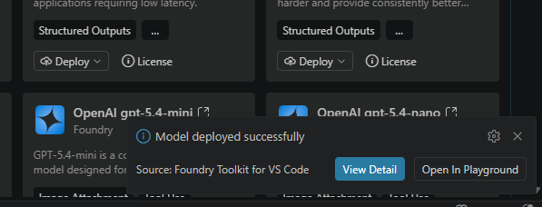
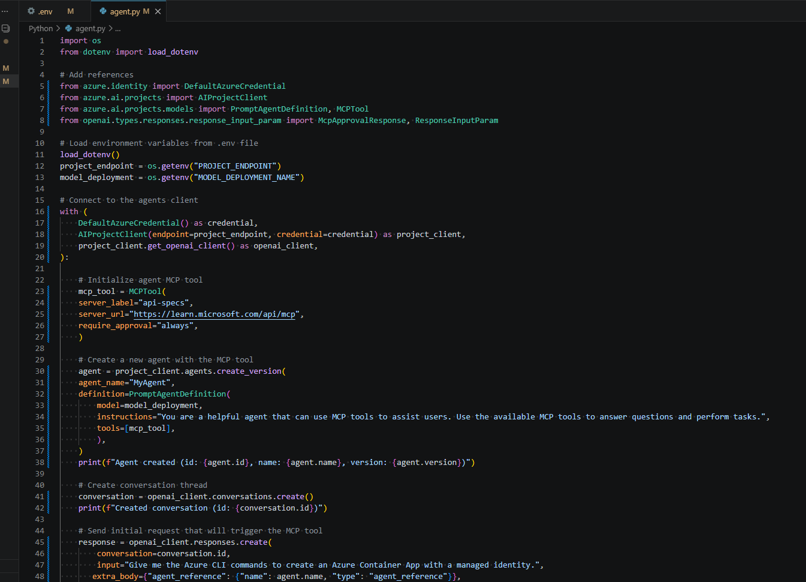
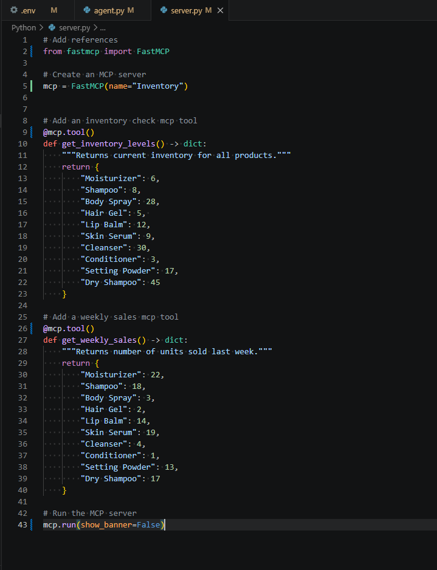
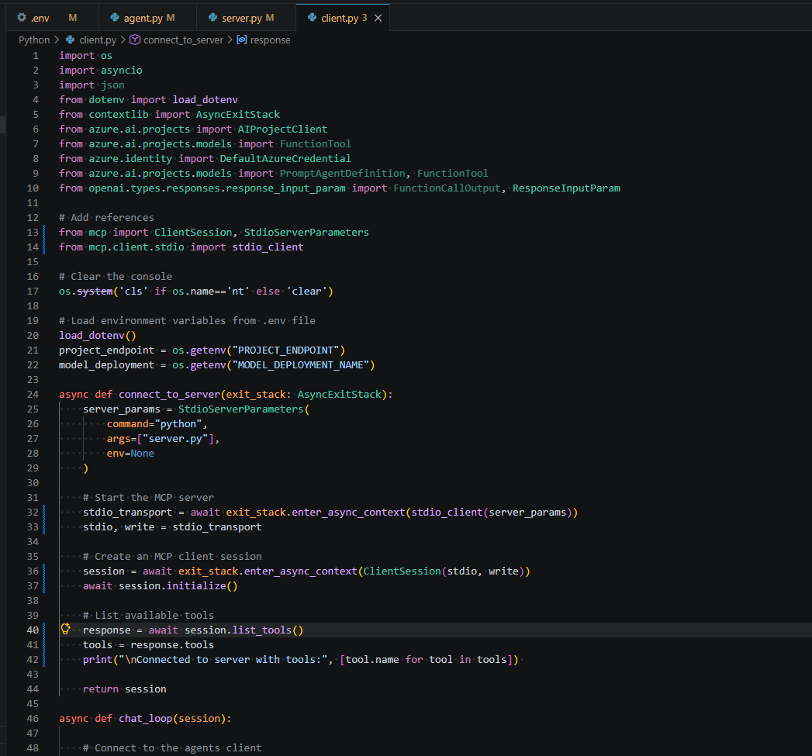
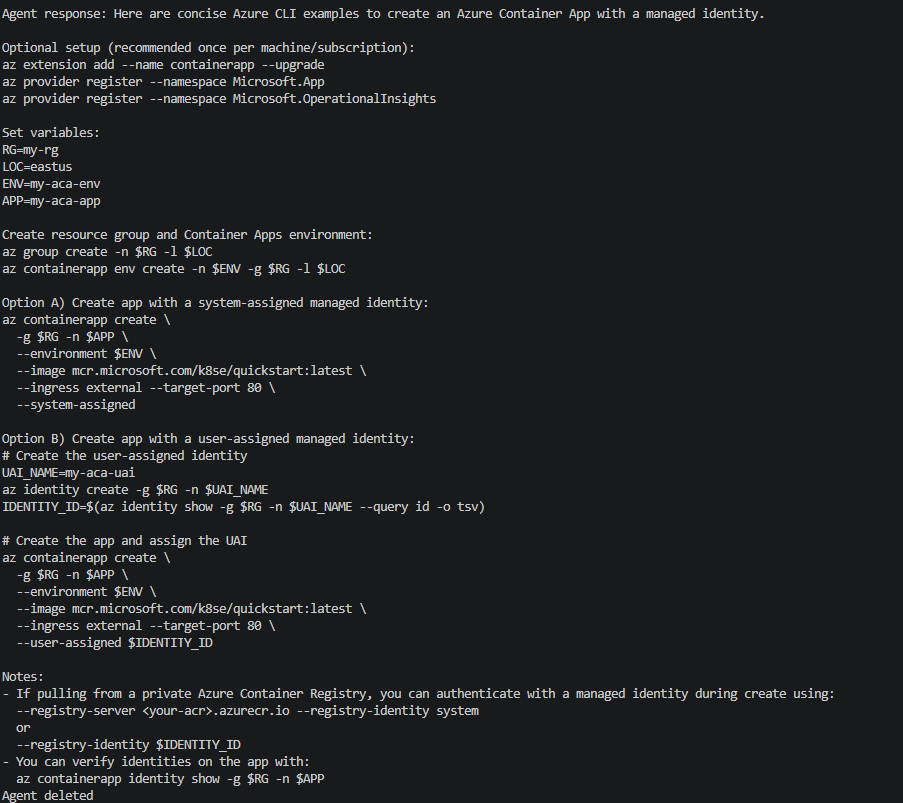
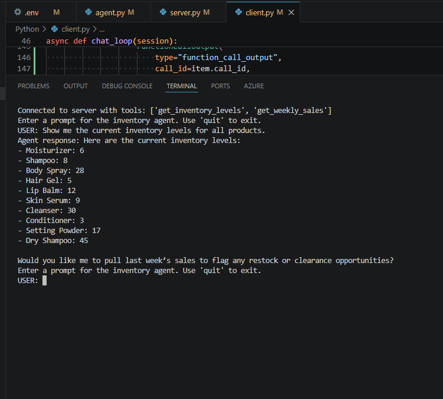
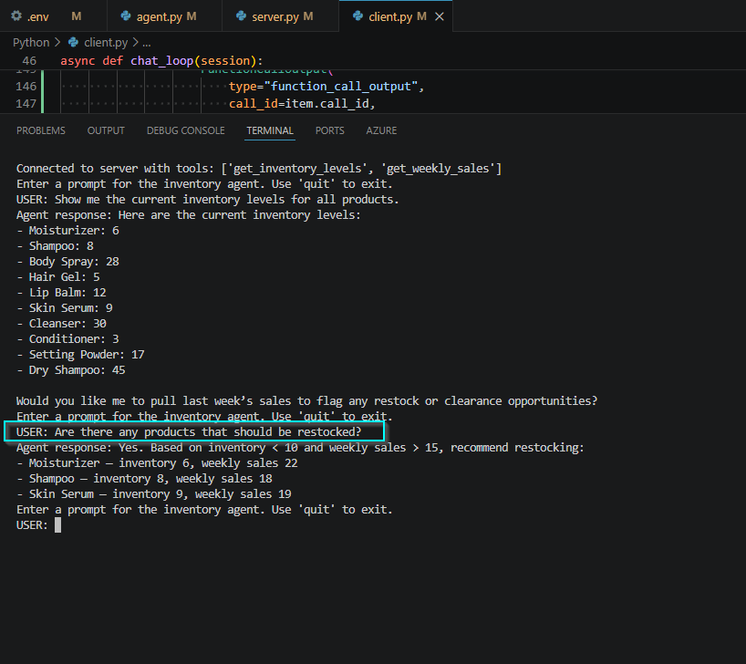
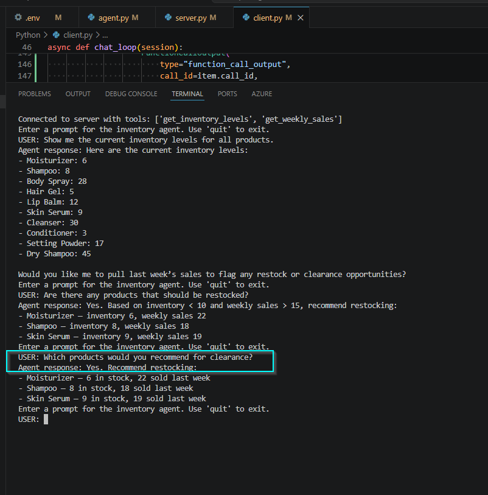

# 🔌 Microsoft Foundry MCP Tool Integration

### Extending AI Agents with Governed External Tool Access

<p align="left">
  
  
  
  
  
  
  
</p>

**Demonstrating how Microsoft Foundry agents can use remote and local MCP tools while exposing the trust, authorization, and policy-enforcement boundaries that must be validated before production use.**

---

## 1. Executive Summary

This project implements Model Context Protocol (MCP) tool integration for a Microsoft Foundry agent using two patterns:

- A **remote Microsoft Learn MCP server** connected through an `MCPTool`.
- A **custom local FastMCP server** exposing inventory and weekly-sales functions to an agent through a Python MCP client.

The implementation validated tool connectivity, dynamic discovery, tool invocation, and multi-tool reasoning. The security review focused on **identity, tool trust, approval semantics, least-functionality, data access, and agent policy reliability**.



*Foundry model deployment confirmed before MCP integration testing.*

---

## 2. Architecture

Two MCP trust paths were evaluated:

```text
Remote MCP

User
  │
  ▼
Microsoft Foundry Agent
  │
  ▼
MCPTool
  │  HTTPS
  ▼
Microsoft Learn MCP Server
  │
  ▼
Tool-assisted response
```

```text
Custom MCP

User
  │
  ▼
Inventory Agent
  │
  ▼
FunctionTool Definitions
  │
  ▼
MCP ClientSession
  │  stdio
  ▼
FastMCP Inventory Server
  ├── get_inventory_levels()
  └── get_weekly_sales()
  │
  ▼
Tool output → model reasoning → response
```

The remote integration introduces an **external-server trust boundary**. The custom implementation keeps the MCP server local and communicates over `stdio`, but still requires the client to trust the tools and schemas exposed by that server.

---

## 3. MCP Integration / Core Implementation

### Remote MCP

The Foundry agent was configured with the public Microsoft Learn MCP endpoint and an explicit approval requirement:

```python
mcp_tool = MCPTool(
    server_label="api-specs",
    server_url="https://learn.microsoft.com/api/mcp",
    require_approval="always",
)
```



*Remote MCP tool configuration and agent integration.*

### Custom FastMCP Server

A local FastMCP server named `Inventory` exposed two narrowly scoped tools:

- `get_inventory_levels`
- `get_weekly_sales`

Both tools were **read-only, parameterless functions** returning synthetic business data. No MCP resources or prompt templates were implemented in this lab.



*Custom FastMCP server exposing two business-specific tools.*

---

## 4. Python / Client Implementation

The Python client launched the local MCP server as a subprocess and communicated with it through `stdio`.

Key implementation points:

- `StdioServerParameters` launched `server.py`.
- `ClientSession` initialized the MCP session.
- `session.list_tools()` dynamically discovered available capabilities.
- Discovered tools were converted into agent-compatible `FunctionTool` definitions.
- Model-requested function calls were mapped back to the matching MCP tool.
- Tool output was returned to the model using `FunctionCallOutput`.

The function schema was configured as a strict empty object because the two tools accept no arguments.



*Client initialization and dynamic MCP tool discovery.*

---

## 5. Validation

| Test | Expected Result | Outcome |
|---|---|---|
| Remote MCP connection | Agent uses remote MCP capability to answer an Azure question | ✅ Pass |
| MCP tool discovery | Client discovers both inventory and sales tools | ✅ Pass |
| Inventory retrieval | Agent returns current inventory values | ✅ Pass |
| Restock recommendation | Apply inventory `< 10` and weekly sales `> 15` | ✅ Pass |
| Clearance recommendation | Apply inventory `> 20` and weekly sales `< 5` | ❌ Policy failure observed |

### Remote MCP Validation



*Remote MCP-backed response successfully returned.*

### Inventory Tool Validation



*Client discovered both MCP tools and successfully retrieved inventory data.*

### Multi-Tool Restock Validation

The agent correctly identified:

- Moisturizer — inventory 6, weekly sales 22
- Shampoo — inventory 8, weekly sales 18
- Skin Serum — inventory 9, weekly sales 19



*Inventory and sales data were combined to apply the configured restock rule.*

---

## 6. Security Observation

### Tool Success Does Not Guarantee Policy Correctness

The strongest finding from the lab was not a connectivity failure. MCP discovery and tool execution worked correctly, but the agent later failed to apply the configured clearance rule.

The intended rule was:

```text
Inventory > 20 AND weekly sales < 5
```

The expected clearance candidates were:

- **Body Spray** — inventory 28, weekly sales 3
- **Cleanser** — inventory 30, weekly sales 4

Instead, the agent returned the previously identified restock products.



*Negative test showing incorrect policy application despite successful MCP tool access.*

This demonstrates an important governance principle:

> **Correct tool execution does not guarantee correct agent decision-making.**

The conversation was stateful and retained prior context. That may have influenced the response, but this test does **not** establish state retention as the root cause. It does establish that model-applied business rules require independent validation.

### Approval Semantics

The remote MCP tool was configured with `require_approval="always"`, but the sample application logic automatically approved the request.

That means an approval mechanism was present, but it did **not** create a meaningful human authorization checkpoint in this implementation.

For production systems, sensitive or write-capable tools should use explicit risk-based authorization rather than blanket application-side approval.

---

## 7. Security Controls

### Observed in the Lab

| Control | Security Relevance | Observation |
|---|---|---|
| `DefaultAzureCredential` | Identity-based Azure authentication | No static Azure client secret was embedded in source code |
| Environment variables | Separates deployment configuration from code | Project endpoint and model deployment name were loaded from `.env` |
| MCP approval requirement | Adds a potential authorization checkpoint | Configured as `always`, but application logic auto-approved requests |
| Narrow custom tool surface | Limits agent capability | Only two read-only business functions were exposed |
| Strict function schema | Reduces unexpected function arguments | Empty parameter object with additional properties disabled |
| Local `stdio` transport | Avoids exposing the custom MCP server as a network listener | Local process trust still remains a security boundary |

### Production Hardening

The lab demonstrated MCP integration; it did **not** implement a complete production security architecture. A production design should additionally consider:

- Authenticate and authorize access to remote MCP servers and individual tools.
- Allowlist approved tool names and schemas rather than trusting dynamic discovery implicitly.
- Require human or policy-based approval for sensitive, destructive, or high-impact actions.
- Enforce deterministic business rules in code or a policy layer when decisions must be exact.
- Treat external MCP output as untrusted input before returning it to model context.
- Add centralized logging for tool discovery, approvals, calls, outputs, and failures.
- Restrict outbound connectivity to approved MCP endpoints.
- Apply least-privilege identities to any backend systems accessed by MCP tools.

No dedicated Microsoft Foundry guardrail layer, prompt-injection control, or destructive-tool authorization test was configured as part of this lab.

---

## 8. Supporting Evidence

| File | Evidence |
|---|---|
| `01-foundry-model-deployment.png` | Successful Microsoft Foundry model deployment |
| `02-remote-mcp-agent-configuration.png` | Remote MCP configuration and approval setting |
| `03-remote-mcp-validation.png` | Successful remote MCP-backed response |
| `04-custom-fastmcp-server.png` | Custom FastMCP server and exposed tools |
| `05-mcp-client-tool-discovery.png` | MCP session initialization and dynamic tool discovery |
| `06-inventory-tool-validation.png` | Successful inventory retrieval |
| `07-multi-tool-restock-validation.png` | Successful multi-tool restock reasoning |
| `08-agent-policy-drift-negative-test.png` | Negative test demonstrating policy drift |

---

## 9. Key Takeaways

- MCP provides a standardized way for agents to discover and invoke external capabilities.
- The MCP server is part of the agent's **trusted computing surface** and should be governed accordingly.
- Dynamic tool discovery increases flexibility but also creates a need for explicit trust and authorization controls.
- Read-only, narrowly scoped tools are safer than broad or write-capable interfaces.
- Approval settings are only effective when the application preserves the intended authorization boundary.
- Agent-generated policy decisions must be validated independently from successful tool execution.

---

## 10. Technologies

- Microsoft Foundry
- Azure AI Agents / Azure AI Projects SDK
- Model Context Protocol (MCP)
- FastMCP
- Python
- Azure Identity / `DefaultAzureCredential`
- OpenAI Responses API
- `python-dotenv`
- MCP `stdio` transport

---

## 11. Reference

**Microsoft Learn — Integrate MCP Tools with Azure AI Agents**  
[Extend agents with Model Context Protocol (MCP) tools](https://microsoftlearning.github.io/mslearn-ai-agents/Instructions/Exercises/03-mcp-integration.html)
