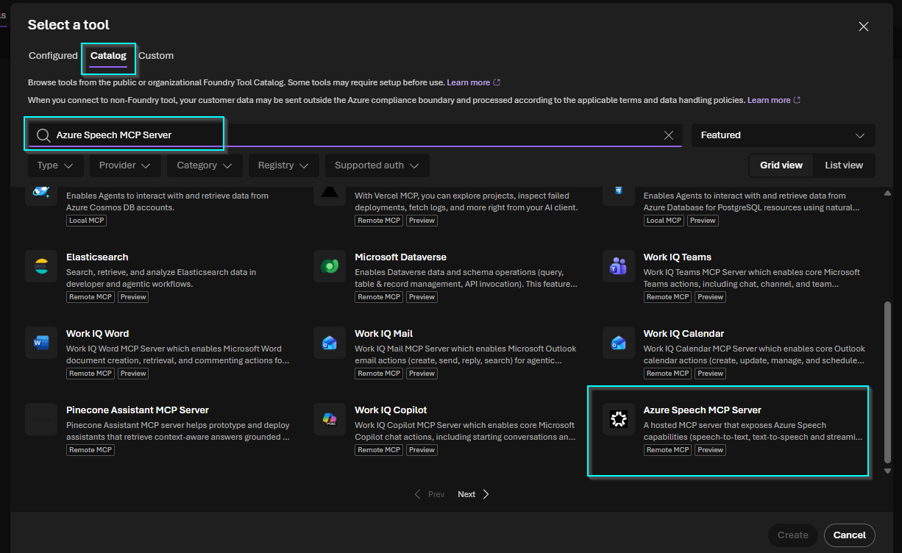
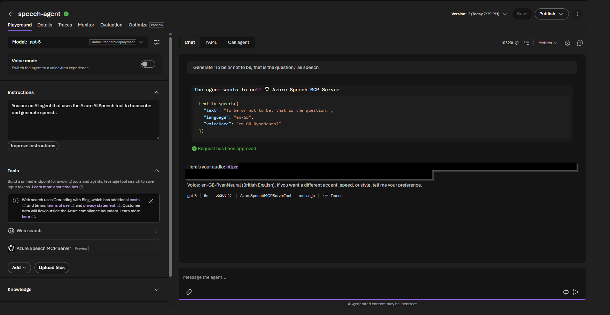
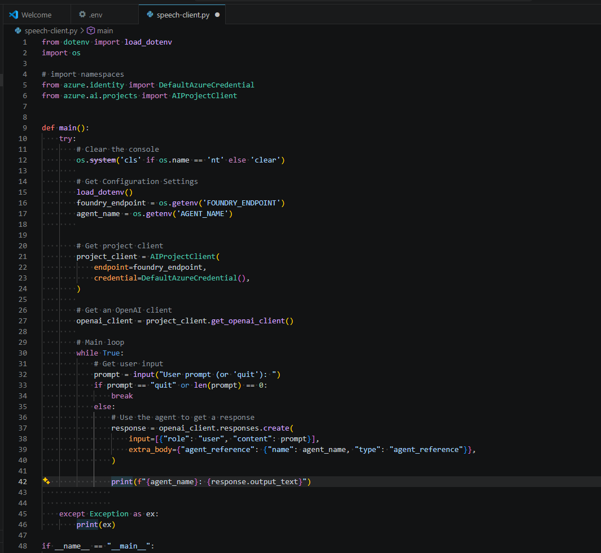
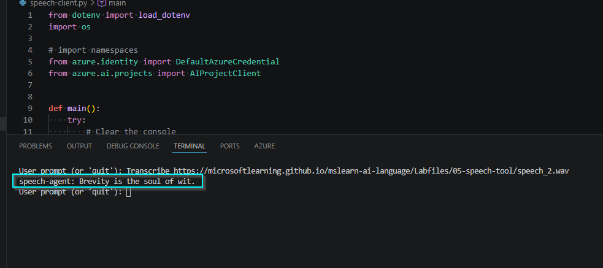
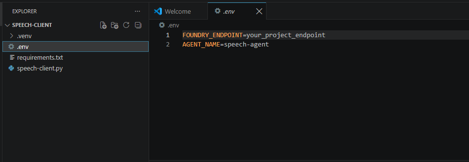
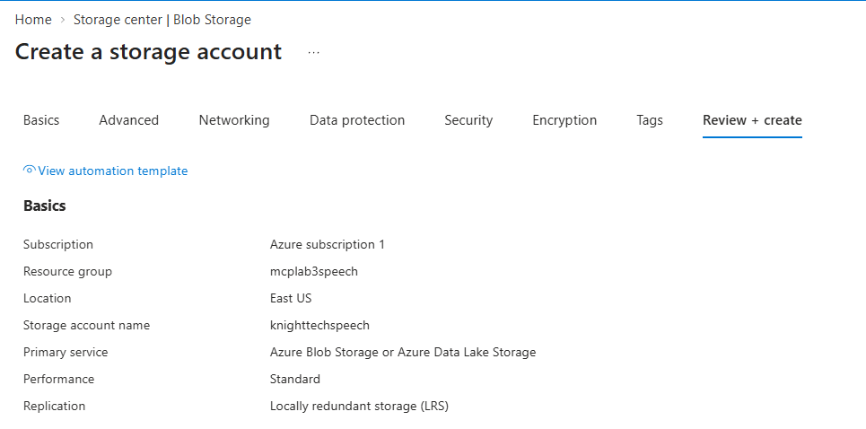
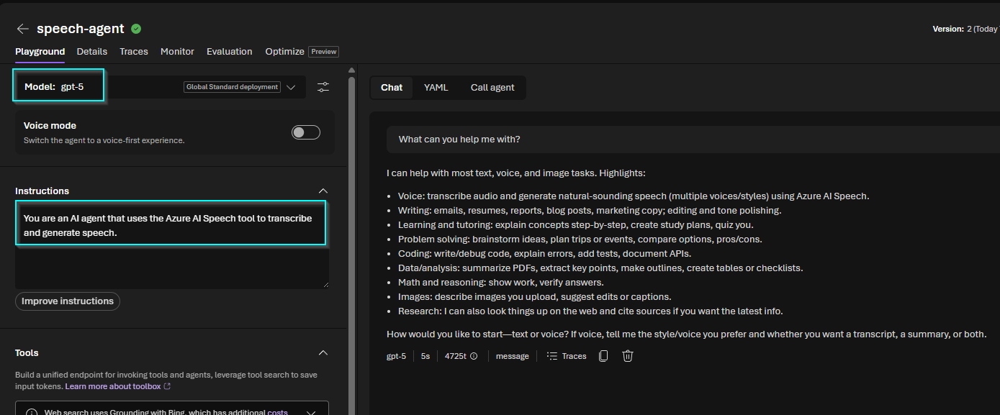

# 🎙️ Azure Speech MCP Agent

## Securing Agent-to-Tool Workflows with Model Context Protocol

<p>
  
  
  
  
  
  
  
</p>

**Demonstrating how a Microsoft Foundry agent can securely invoke Azure Speech capabilities through MCP while maintaining identity, tool authorization, storage controls, and downstream guardrails.**

---

## Executive Summary

This project implements a **Microsoft Foundry agent** connected to the **Azure Speech MCP Server** for **speech-to-text (STT)** and **text-to-speech (TTS)** operations.

The solution was validated in the Foundry Playground and through a Python client using Azure identity. The security review focused on **MCP trust boundaries, tool approval, scoped storage access, secret handling, and guardrail behavior**.

---

## Architecture

```text
Python Client
     │
     ▼
Microsoft Foundry Agent
     │
     ▼
Azure Speech MCP Server
     │
     ├── Speech-to-Text → Transcription
     │
     └── Text-to-Speech → Azure Blob Storage
```

The client invokes the **Foundry agent**, not Azure Speech directly. MCP provides the tool layer between the agent and the downstream speech service.

---

## MCP Integration

The agent was configured with the **Azure Speech MCP Server** as an external capability.



*Azure Speech MCP Server added as an agent tool.*

Text-to-speech testing confirmed successful MCP tool selection, approval, and execution.



*Successful `text_to_speech` invocation. Sensitive SAS data was removed before publication.*

---

## Python Agent Client

The Python client uses `AIProjectClient` with `DefaultAzureCredential` and invokes the configured Foundry agent through the Responses API.

```python
project_client = AIProjectClient(
    endpoint=foundry_endpoint,
    credential=DefaultAzureCredential(),
)

openai_client = project_client.get_openai_client()

response = openai_client.responses.create(
    input=[{"role": "user", "content": prompt}],
    extra_body={
        "agent_reference": {
            "name": agent_name,
            "type": "agent_reference"
        }
    },
)
```



*Python client using Azure identity and an agent reference.*

---

## Validation

| Test | Result |
|---|---|
| MCP tool connection | ✅ Passed |
| Text-to-Speech | ✅ Passed |
| Speech-to-Text | ✅ Passed |
| Python agent invocation | ✅ Passed |
| Blob audio output | ✅ Passed |
| Guardrail enforcement | ✅ Observed |



*Successful end-to-end speech transcription through the Python client.*

---

## Security Observation

During repeated STT testing, the Azure Speech MCP tool successfully returned the expected transcription, but a downstream **Microsoft Foundry guardrail** subsequently blocked the agent interaction.



*Successful MCP speech transcription followed by Foundry guardrail enforcement.*

This demonstrated that **tool execution and agent-level safety enforcement are separate control points**.

---

## Security Controls

| Control | Security Value |
|---|---|
| `DefaultAzureCredential` | Avoids hard-coded Azure credentials in application code |
| MCP Tool Approval | Adds a control point before agent tool execution |
| Scoped SAS Access | Limits Blob Storage access for generated audio |
| Environment Variables | Keeps configuration outside source code |
| Guardrails | Provides downstream safety enforcement |
| Sanitized Evidence | Prevents secrets and signed URLs from entering source control |

For production use, I would also evaluate managed identity, centralized secret storage, tighter SAS lifetimes, tool allowlisting, audit logging, and network isolation requirements.

---

## Supporting Evidence

### Azure Blob Storage



*Blob Storage configured for generated speech artifacts.*

### Foundry Speech Agent



*Speech agent configured in Microsoft Foundry.*

---

## Key Takeaways

- MCP expands an agent's security boundary into external tools and services.
- Identity and tool authorization are as important as model-level controls.
- Successful tool execution does not guarantee the final agent response will be allowed.
- Secrets, SAS tokens, and environment-specific configuration should remain outside source control.

---

## Technologies

**Microsoft Foundry · Model Context Protocol (MCP) · Azure Speech · Azure Blob Storage · Python · Azure Identity · OpenAI Responses API**

---

## Reference

- [Microsoft Learn — Develop a speech agent with the Azure Speech MCP server](https://learn.microsoft.com/en-us/training/modules/develop-speech-agent-speech-mcp/)
- [Microsoft Learn — Exercise](https://learn.microsoft.com/en-us/training/modules/develop-speech-agent-speech-mcp/04-exercise)
- [Microsoft Learning Lab Flow — Develop a speech agent with Azure Speech MCP](https://microsoftlearning.github.io/mslearn-ai-language/Instructions/Exercises/05-azure-speech-mcp.html)

---

**Project Status:** ✅ Complete

---

### Attribution

This project was completed using learning materials and lab instructions provided by **Microsoft Learn**. The implementation, validation, screenshots, documentation, and security observations presented in this portfolio reflect my hands-on execution and analysis of the exercise.

Microsoft product names and trademarks are the property of Microsoft Corporation. This portfolio is independently maintained and is not affiliated with or endorsed by Microsoft.
