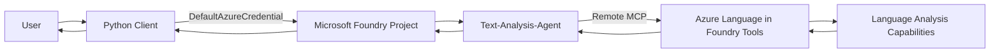
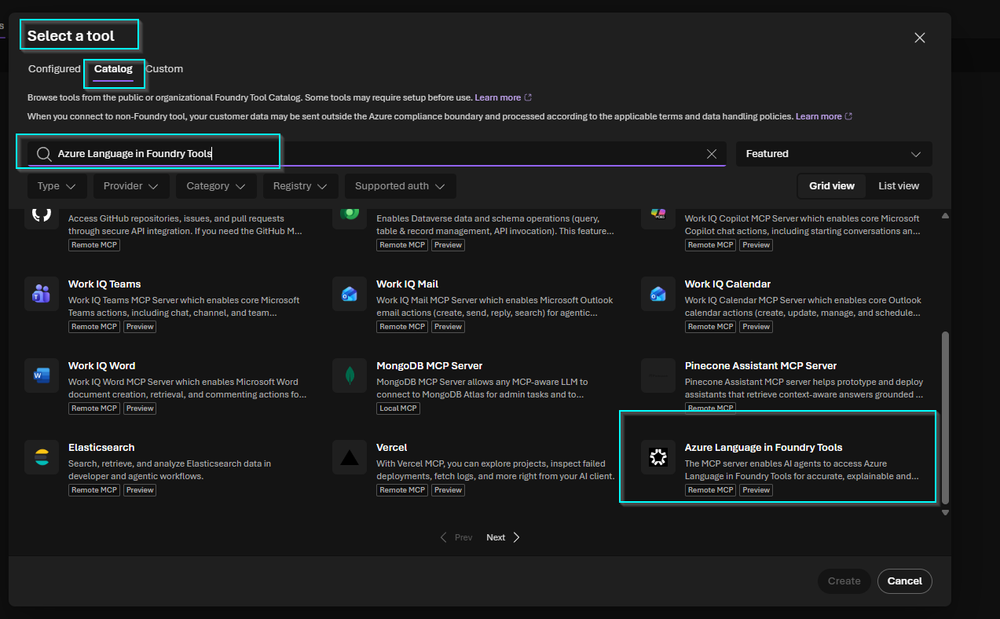
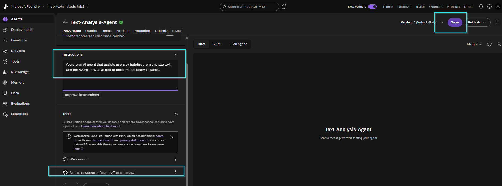
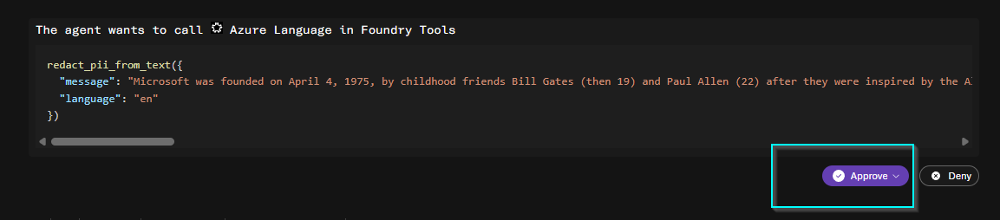
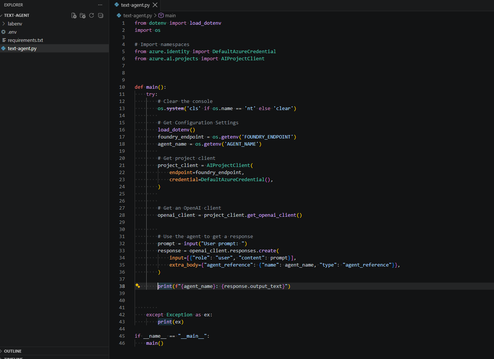
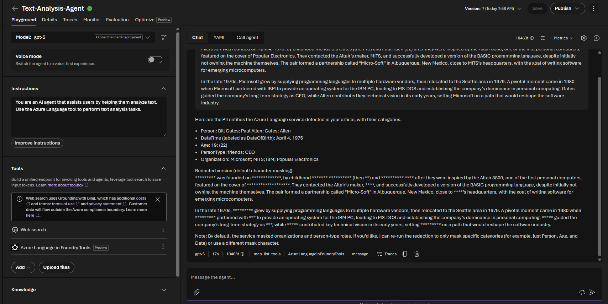
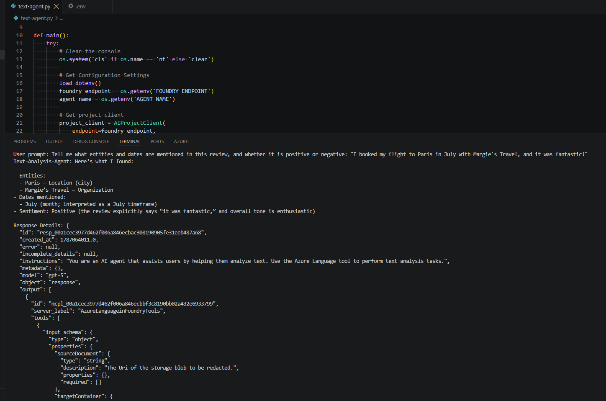

# 🔗 Develop a Text Analysis Agent with MCP

### Securing Agent-to-Tool Access with Microsoft Foundry and Azure Language

  
  
  
  
  
  
  

**Demonstrating how a Microsoft Foundry agent can invoke Azure Language capabilities through MCP while exposing the authorization, identity, and trust-boundary decisions that must be governed in production.**

---

## Executive Summary

This project implements a **Microsoft Foundry text-analysis agent** connected to **Azure Language in Foundry Tools through a remote Model Context Protocol (MCP) server**.

The agent was validated with PII redaction, named-entity recognition, date extraction, and sentiment analysis. A Python client then invoked the existing Foundry agent and confirmed that a single natural-language request could trigger multiple specialized MCP tools.

The security focus was not only whether the agent produced the correct answer, but also **how tool access, approval, identity, sensitive data, and MCP trust boundaries were handled**.

---

## Architecture

The primary trust boundaries are **client-to-Foundry**, **agent-to-MCP server**, and **MCP server-to-language capability**. Text submitted for analysis can cross these boundaries and may contain sensitive information.

*Figure 1. Azure Language selected as the remote MCP capability for the Foundry agent.*

---

## MCP Integration / Core Implementation

The **Text-Analysis-Agent** was configured to use Azure Language for text-analysis tasks rather than relying only on free-form model generation.

The MCP integration exposed specialized capabilities including PII redaction, entity extraction, sentiment analysis, language detection, summarization, and key-phrase extraction. The agent could discover these tools and select the capabilities required for the request.

*Figure 2. Text-Analysis-Agent configured with the Azure Language MCP tool.*

During Foundry Playground testing, an explicit approval request was observed before a PII-redaction tool call.

*Figure 3. MCP tool invocation presented for approval before execution.*

---

## Python or Client Implementation

A Python client was built with the Azure AI Projects SDK to invoke the existing Foundry agent.

Key implementation choices:

- `DefaultAzureCredential` authenticated the client to Microsoft Foundry.
- `AIProjectClient` established the project connection.
- `get_openai_client()` provided the client used to invoke the agent.
- `FOUNDRY_ENDPOINT` and `AGENT_NAME` were loaded from environment configuration rather than embedded directly in application logic.
- `responses.create()` referenced the existing `Text-Analysis-Agent`, preserving the agent-to-MCP orchestration layer.

*Figure 4. Python client implementation used to invoke the Foundry agent.*

---

## Validation

| Test | Validation | Result |
|---|---|---|
| PII redaction | Agent invoked the Azure Language MCP capability and returned redacted text | ✅ |
| Client invocation | Python client successfully invoked the Foundry agent | ✅ |
| Multi-tool analysis | One prompt required both entity extraction and sentiment analysis | ✅ |
| Tool-call verification | Raw response confirmed completed MCP calls | ✅ |

The Foundry Playground test successfully detected PII categories and returned redacted output.

*Figure 5. Successful PII detection and redaction through the Azure Language MCP integration.*

The final Python test asked the agent to identify entities and dates and determine sentiment. The response identified **Paris**, **Margie's Travel**, **July**, and **positive sentiment**. The detailed response confirmed completed calls to:

- `extract_named_entities_from_text`
- `detect_sentiment_from_text`

*Figure 6. End-to-end Python client validation with MCP-backed entity and sentiment analysis.*

---

## Security Observation or Security Analysis

### MCP Is a Trust Boundary

MCP gives an agent access to capabilities outside the base model. That makes the **agent-to-tool boundary an authorization boundary**, not simply an integration detail.

### Approval Is a Policy Decision

The Playground demonstrated an explicit approval prompt for a tool invocation. The later client response showed the MCP configuration with `require_approval: "never"`.

This demonstrates that approval behavior is configurable. Automatic approval is convenient for testing, but production systems should determine approval requirements based on the impact of each tool.

### Identity and Authentication Are Different Across Boundaries

The Python client used `DefaultAzureCredential` to authenticate to Foundry, while the lab's Azure Language MCP connection used **key-based authentication**.

For production, identity-based access should be preferred where supported, and any remaining keys should be centrally stored, rotated, and monitored.

### Sensitive Data Reaches the Tool Layer

PII detection and redaction were successfully validated, but the source text must still be sent to the analysis capability before it can be classified or redacted. Data classification, minimization, residency, retention, and logging requirements therefore remain relevant.

### Tool Exposure Should Be Minimized

The Azure Language MCP server exposed more capabilities than were required for the final test. Production implementations should limit an agent to the **minimum set of tools required for its business function**.

> This lab focused on MCP tool governance, identity, approval, and sensitive-data handling. A separate Microsoft Foundry Guardrails policy set was **not** configured or validated as part of this exercise.

---

## Security Controls

| Area | Demonstrated in Lab | Production Hardening |
|---|---|---|
| Client identity | `DefaultAzureCredential` used for Foundry access | Prefer managed identity or scoped Entra ID identities where applicable |
| MCP authentication | Key-based Azure Language connection | Prefer identity-based auth where supported; otherwise vault and rotate keys |
| Tool authorization | Explicit approval observed; auto-approval also observed | Apply risk-based approval and tool allowlists |
| Tool scope | MCP tool discovery enabled multiple Language capabilities | Expose only required tools and operations |
| Sensitive data | PII detection and redaction validated | Apply data minimization, classification, retention, and DLP requirements |
| Secret handling | Credentials were not hard-coded into Python logic | Keep secrets out of source control and store them in a managed secret store |
| Observability | Tool names, status, and MCP-call details were visible in responses | Centralize traces and audit logs for agent/tool activity |

---

## Supporting Evidence

| File | Evidence |
|---|---|
| `01-azure-language-remote-mcp-selection.png` | Azure Language identified as a remote MCP capability |
| `02-text-analysis-agent-mcp-configuration.png` | MCP tool attached to the Text-Analysis-Agent |
| `03-mcp-tool-approval-validation.png` | Human approval boundary demonstrated |
| `04-pii-redaction-validation.png` | Successful MCP-backed PII detection and redaction |
| `05-python-foundry-agent-client.png` | Python client and Foundry authentication pattern |
| `06-multi-tool-text-analysis-validation.png` | End-to-end client result and multi-tool MCP validation |

---

## Key Takeaways

- **MCP decouples the agent from individual API integrations** and exposes specialized capabilities through a common tool interface.
- A single natural-language request can cause an agent to **select and invoke multiple specialized tools**.
- The important AI-security controls move beyond the model itself to **identity, tool authorization, approval, tool scope, sensitive-data handling, and observability**.
- Successful agent output is not enough; **tool-call evidence should be validated** to confirm which external capabilities actually executed.
- Production MCP deployments should apply **least privilege to tools just as they would to users, applications, and service identities**.

---

## Technologies

| Category | Technology |
|---|---|
| AI Platform | Microsoft Foundry |
| Model | GPT-5 |
| Tool Service | Azure Language in Foundry Tools |
| Integration | Model Context Protocol (MCP) |
| SDK | Azure AI Projects |
| Identity | Azure Identity / `DefaultAzureCredential` |
| Language | Python |
| Configuration | `python-dotenv` |
| Development | Visual Studio Code |

---

## Reference

- [Microsoft Learn — Develop a text analysis agent with the Azure Language MCP server](https://learn.microsoft.com/en-us/training/modules/develop-text-analysis-agent-language-mcp/)
- [Microsoft Learn — Exercise](https://learn.microsoft.com/en-us/training/modules/develop-text-analysis-agent-language-mcp/04-exercise)
- [Microsoft Learning Lab Flow — Develop a Text Analysis Agent](https://microsoftlearning.github.io/mslearn-ai-language/Instructions/Exercises/02-language-agent.html)
  
---

**Project Status:** ✅ Complete

---

### Attribution

This project was completed using learning materials and lab instructions provided by Microsoft Learn. The implementation, validation, screenshots, documentation, and security observations presented in this portfolio reflect my hands-on execution and analysis of the exercise.

Microsoft product names and trademarks are the property of Microsoft Corporation. This portfolio is independently maintained and is not affiliated with or endorsed by Microsoft.
