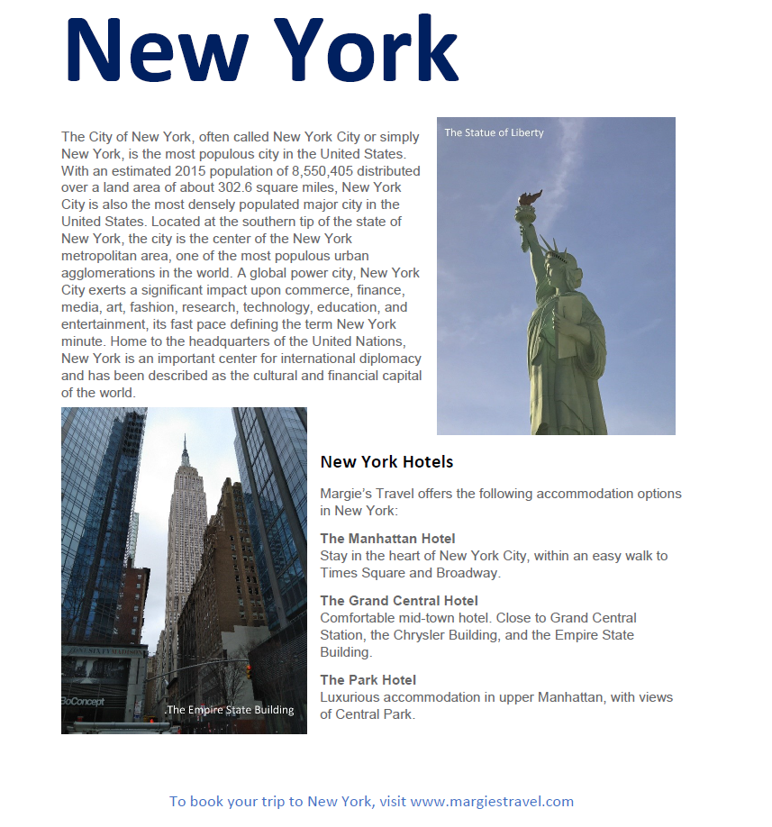
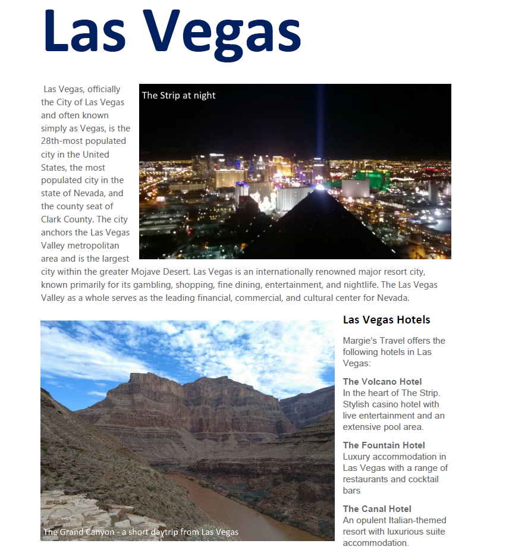
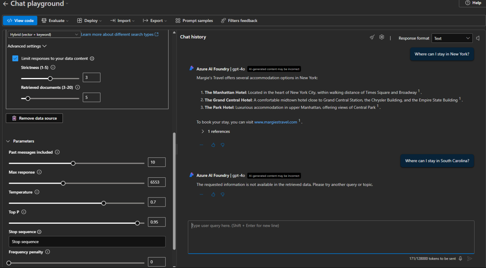
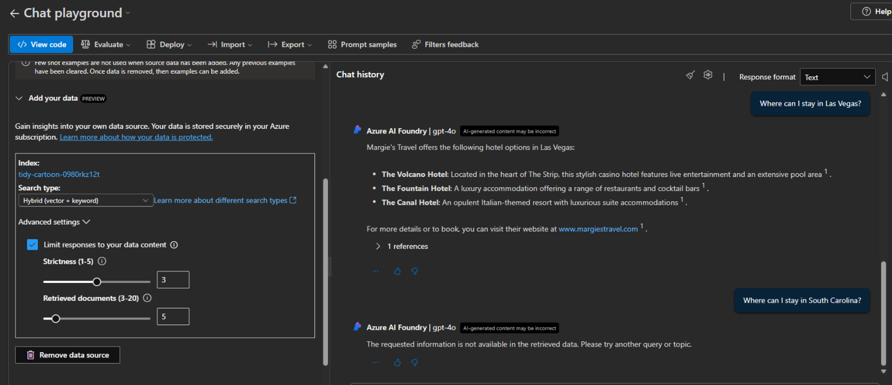

# Secure RAG Implementation with Azure AI Search + GPT-4o

## Exploring Secure Retrieval-Augmented Generation (RAG)

Large language models are most effective when grounded in trusted enterprise data rather than relying solely on pre-trained knowledge.

This lab demonstrates how Azure AI Search and Azure OpenAI can be combined to create a secure Retrieval-Augmented Generation (RAG) workflow where responses are restricted to approved indexed content.

By integrating vector search, document chunking, embeddings, and indexed knowledge retrieval, the model generates responses based only on approved enterprise data rather than unsupported assumptions.

This approach improves response accuracy, reduces hallucinations, and strengthens trust in AI-generated output.

---

## Environment

- Platform: Microsoft Foundry (Azure AI)
- Model: GPT-4o
- Embedding Model: text-embedding-ada-002
- Search Service: Azure AI Search
- Search Type: Hybrid (Vector + Keyword)
- Data Source: Travel brochure PDFs
- Index: brochures-index
- Security Focus: Data grounding + access control

---

## 📄 Source Data Demonstration

### Indexed Enterprise Data (Travel Brochures)

The data source used for retrieval consisted of PDF travel brochures from Margie’s Travel. These documents served as the trusted knowledge base for grounding model responses.

Only information contained within these indexed documents could be returned by the model.

### New York Brochure Example

---

### Las Vegas Brochure Example

---

## 🔍 Grounded Response Demonstration

### Successful Grounded Response

With **"Limit responses to your data content"** enabled and Hybrid Search configured, the model successfully retrieved hotel recommendations directly from the indexed brochure content.

### Prompt

> Where can I stay in New York?

### Model Response

The model returned only approved brochure content, including hotel names and supporting references.

---

## 🚫 Hallucination Prevention Demonstration

### Unsupported Query Rejection

When a question was asked about a location that did not exist in the indexed brochure dataset, the model correctly refused to generate an unsupported answer.

### Prompt

> Where can I stay in South Carolina?

### Model Response

Response returned:

> The requested information is not available in the retrieved data. Please try another query or topic.

This demonstrates effective retrieval grounding and reduced hallucination risk.

---

## 🔎 Observation: Why Data Grounding Matters

The strongest validation in this lab was not when the model answered correctly—it was when it refused to answer unsupported questions.

By restricting responses to indexed enterprise-approved content, RAG improves trust, reduces hallucination risk, and strengthens governance over AI-generated output.

This architecture ensures the model responds based on approved knowledge rather than unsupported assumptions or open-ended generation.

In enterprise deployments, retrieval architecture becomes part of the security boundary.

---

## Reference

These labs were completed using Microsoft Learn guided exercises as a foundation for validating Azure AI Engineer Associate (AI-102) concepts.

The focus of this portfolio is not lab completion alone, but secure implementation, governance, and practical enterprise application through an AI security architecture perspective.
