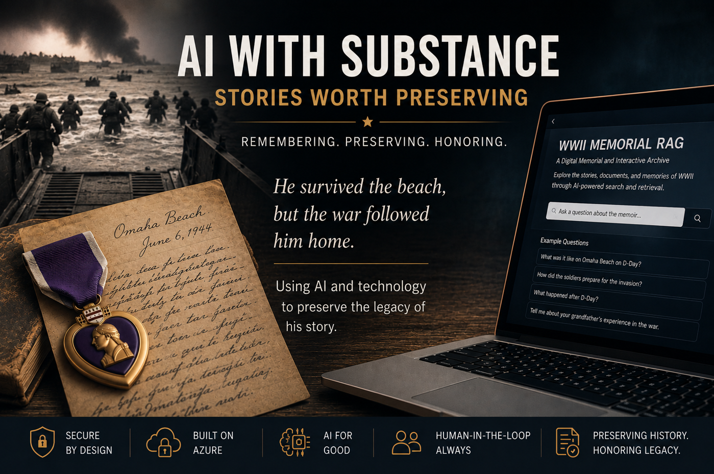
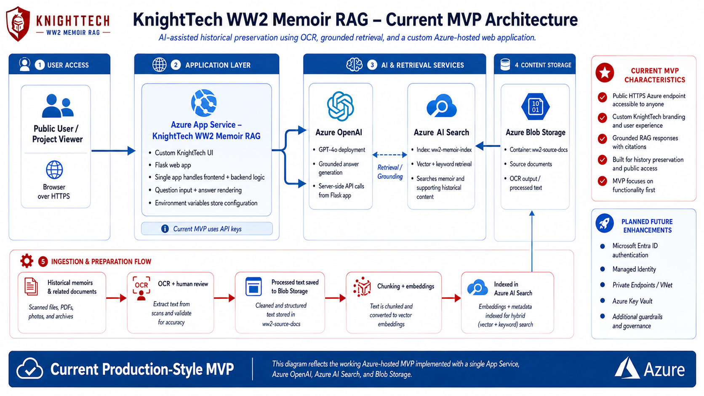
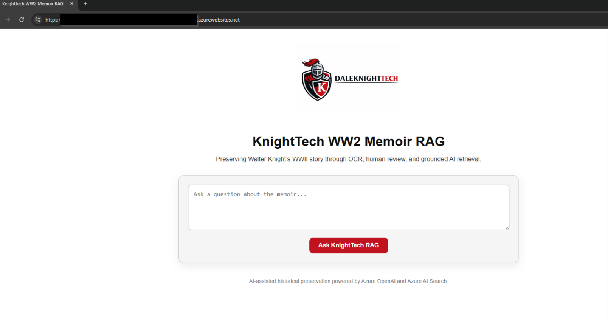
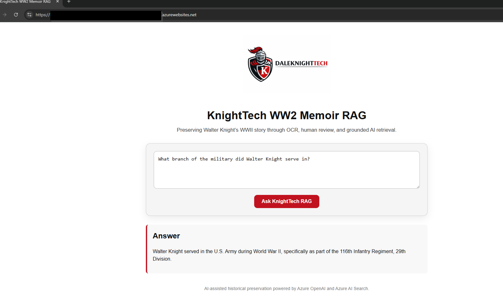
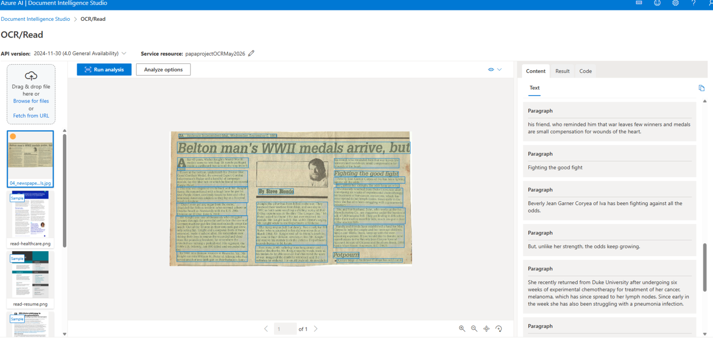
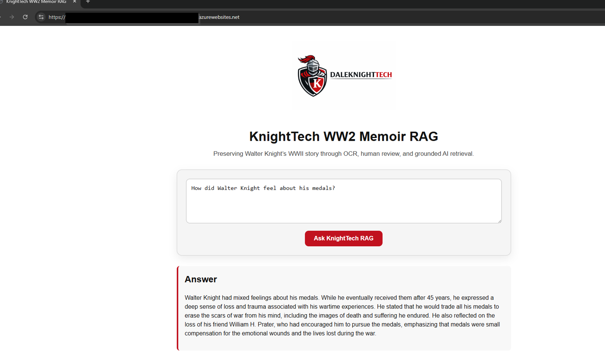
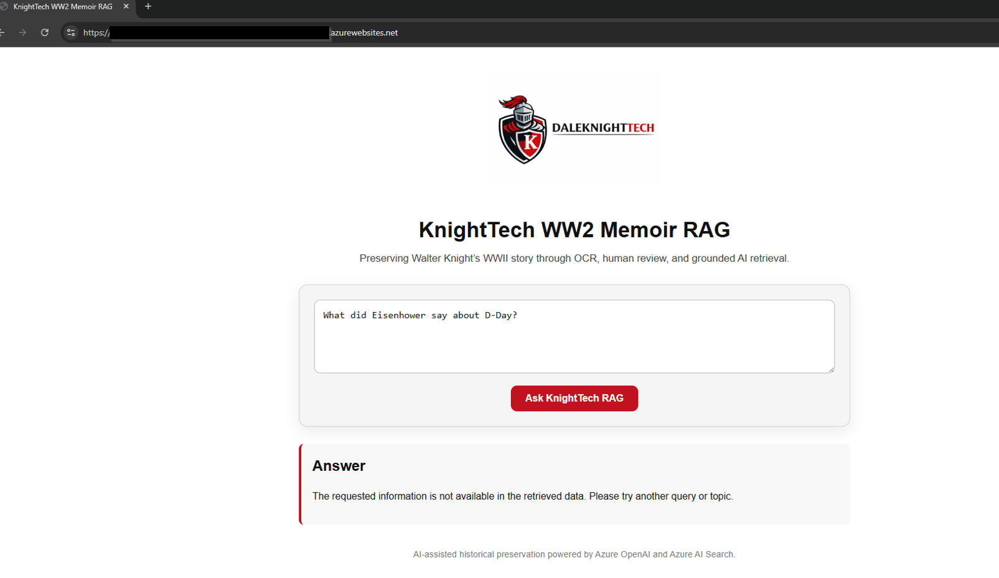

# KnightTech WW2 Memoir RAG

> Look what AI can help preserve.

AI-assisted historical preservation using OCR, human review, Azure AI Search, Azure OpenAI, and a custom Azure-hosted Flask UI.

This project is a working MVP that uses Retrieval-Augmented Generation (RAG) to preserve and query the WWII memoir and related historical materials of Walter Knight. The goal was not to build another generic chatbot, but to use AI to help preserve a family story, historical context, and personal legacy through grounded retrieval.

---

## Project Purpose

This project was built around a simple idea:

**Technology matters most when it helps preserve what makes us human.**

The source material included historical documents, OCR-processed text, article content, and reviewed memoir material. The final MVP allowed a user to ask questions through a custom KnightTech web interface and receive answers grounded in the indexed source material.

The project focused on:

- Historical preservation
- AI for good
- OCR and human-in-the-loop review
- Grounded retrieval from source documents
- Responsible AI behavior
- Custom Azure-hosted deployment

---

## AI-Assisted Preservation Theme

---

## Current MVP Architecture

The current MVP used a single Azure App Service to host a custom Flask application. The Flask app handled both the frontend UI and backend logic. User questions were submitted through the KnightTech interface and processed server-side using Azure OpenAI and Azure AI Search.

**High-level flow:**

- User Browser
- HTTPS
- Azure App Service
- Flask backend
- Azure OpenAI GPT-4o
- Azure AI Search
- Indexed source material
- Azure Blob Storage / OCR-processed documents

The architecture intentionally separated the public user experience from backend AI service calls. The browser never directly accessed Azure OpenAI or Azure AI Search keys. The Flask backend handled the server-side orchestration.

---

## Technologies Used

- Azure AI Foundry
- Azure OpenAI / GPT-4o
- Azure AI Search
- Azure Blob Storage
- Azure App Service
- Python / Flask
- Gunicorn
- OCR / document processing
- Human-in-the-loop text review
- Retrieval-Augmented Generation
- App Service environment variables
- GitHub portfolio documentation

---

## Custom Azure-Hosted UI

A custom Flask-based KnightTech interface was built instead of relying on the default Microsoft Foundry sample web app.

The UI included:

- KnightTech branding
- Question input field
- Answer display panel
- Azure-hosted HTTPS endpoint
- Server-side calls to Azure OpenAI and Azure AI Search

This confirmed the project was not only running in a local development environment, but deployed as a cloud-hosted MVP.

---

## Grounded Retrieval Example

The RAG system was tested with direct factual questions from the source material.

Example question:

> What branch of the military did Walter Knight serve in?

The system returned a grounded answer based on the indexed memoir and supporting documents. This validated that the custom UI was successfully connected to the Azure RAG backend.

---

## OCR + Human Review Process

Source: Anderson Independent-Mail article by Steve Biondo, 1989.

OCR was used to extract text from historical source material. Human review remained essential to validate accuracy, correct OCR issues, and ensure the preserved content remained faithful to the original material.

This project reinforced an important lesson:

**AI can assist preservation, but human oversight is still required.**

OCR and AI were used as tools in the preservation process, not replacements for review, context, or judgment.

---

## RAG Output from Historical Article Content

After OCR and review, processed source material was indexed into Azure AI Search and made available for grounded retrieval.

This allowed the application to answer questions based on historical article content and supporting documents.

The result demonstrated the full loop:

- Historical source material
- OCR extraction
- Human review
- Azure AI Search indexing
- Grounded RAG response

---

## Source-Limited Behavior

The system was also tested with out-of-scope questions to confirm that it did not simply answer from general model knowledge.

When the information was not available in the indexed source material, the application avoided inventing an answer.

This behavior is important for responsible RAG design because the goal is not just to generate fluent responses, but to keep answers grounded in trusted source material.

---

## Implementation Summary

The MVP was built in several phases:

1. Created a local custom KnightTech Flask UI.
2. Processed historical documents using OCR and human review.
3. Uploaded source material to Azure Blob Storage.
4. Created an Azure AI Search index for retrieval.
5. Connected Azure OpenAI to the indexed source material.
6. Tested grounded responses in Azure AI Foundry.
7. Connected the custom Flask UI to the Azure RAG backend.
8. Deployed the Flask application to Azure App Service over HTTPS.
9. Stored runtime configuration using App Service environment variables.
10. Validated factual, narrative, and out-of-scope prompts.
11. Rotated keys after testing and tore down cloud resources to control cost.

---

## MVP Security Notes

This project was built as a functional MVP focused on preservation, grounded retrieval, and Azure-hosted deployment.

For the MVP:

- API keys were stored in Azure App Service environment variables.
- Local secrets were stored in a `.env` file.
- `.env` was excluded from source control using `.gitignore`.
- Keys were rotated after testing.
- The browser never directly accessed Azure OpenAI or Azure AI Search keys.
- Backend service calls were handled server-side through Flask.

Future production hardening could include:

- Microsoft Entra ID authentication
- Managed Identity
- Azure Key Vault
- RBAC-based service access
- Private endpoints / VNet integration
- Improved monitoring and logging
- Cleaner citation display
- Additional prompt and content guardrails

---

## Lessons Learned

- OCR is powerful, but human review is critical when preserving historical records.
- RAG works best when source material is clean, structured, and intentionally scoped.
- Broad questions may require a project overview document to improve retrieval quality.
- Custom UI development provides more control than relying on generated sample applications.
- Azure App Service deployment introduced real-world packaging and runtime path challenges.
- Grounded AI can help preserve historical context without replacing human judgment.
- A working MVP does not need to be perfect to demonstrate meaningful value.

---

## Future Enhancements

Potential next steps:

- Add a project overview document to improve broad context questions.
- Improve citation and source display in the UI.
- Add Microsoft Entra ID authentication for controlled access.
- Move secrets to Azure Key Vault or Managed Identity-based access.
- Add private networking and stricter RBAC controls.
- Expand the document collection with additional reviewed historical records.
- Create a long-term private family-facing version of the application.

---

## Resource Teardown

Azure resources for this MVP were torn down after validation and screenshot capture to control cost.

The project can be rebuilt later using the saved Flask code, documentation, architecture notes, screenshots, and source document workflow.

---

## Reflection

This project was not about building another chatbot.

It was about using OCR, human review, and grounded AI retrieval to help preserve a human story that could have faded with time.

Walter Knight’s WWII memoir and related historical materials became searchable, accessible, and easier to share with future generations.

**Technology matters most when it helps preserve what makes us human.**

---

## Veteran Support Resource

(images/veteranscrisisline.png)

Because this project discusses WWII service, visible and invisible wounds, PTSD, and the lasting impact of war, I want to include a support resource for veterans, service members, and their loved ones.

The **Veterans Crisis Line** provides free, confidential support 24/7. You do **not** have to be enrolled in VA benefits or VA health care to connect. 

- **Dial 988 then Press 1**
- **Text 838255**
- **Chat online through the Veterans Crisis Line website**

Learn more: https://www.veteranscrisisline.net/

This project is about preservation, legacy, and honoring those who served. If this work reaches even one person who needs support, then including this resource matters.
